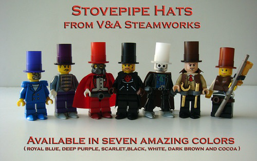
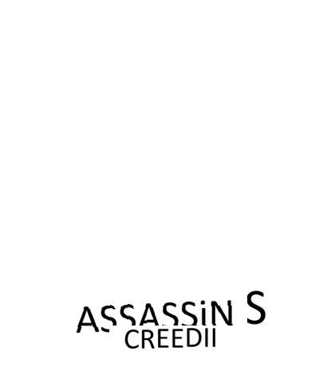
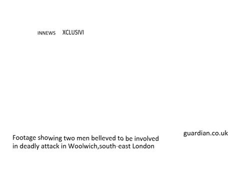

| Original Image | Condition Image | Original caption | Blip caption | LLAVA caption | LLAVA-LLAMA2 caption |
 | --- | --- | --- | --- | --- | --- |
|  |  | Dad Not Daddy | a pillow with the words dad not daddy | A white pillow with pink lettering is seen on a bed. The lettering on the pillow reads "daddy not dady," which seems to be a comical take on a familiar phrase. The pillow is located in the center of the bed, drawing attention to its unique design. | The pillow has a pink ribbon and the words "Dad Not Daddy" written on it, and it is placed on a bed. |
|  |  | Submarine waiting for orders | a submarine in the ocean with red light | A large submarine is situated in the middle of the ocean, surrounded by a beautiful sunset. The warm glow of the sunset casts a serene atmosphere over the scene. Several people are scattered throughout the image, likely enjoying the view or attending to their tasks on the vessel. | The submarine is partially visible in the water, with its top portion above the water. The sky is red, which could be due to sunset or sunrise. The scene is set against the backdrop of the ocean. |
|  |  | critical thinking: Critical Thinking Creative Brainstorm People Concept | critical thinking concept | A group of seven people standing in a line, each person having a thought bubble above their head with positive emotions. The scene takes place in a classroom setting, with several chairs placed around the room, indicating a space for group activities or discussions. | In the image, there are five people standing in front of a whiteboard, with a cartoon drawing of a person with a thought bubble. The whiteboard has the words "Critical Thinking" written on it. The people appear to be discussing or presenting ideas related to critical thinking, problem-solving, or decision-making. The drawing of the person with a thought bubble suggests that they are sharing their thoughts and ideas in a creative and engaging manner. This scene likely represents a group discussion or presentation focused on critical thinking, problem-solving, or decision-making. |
|  |  | 1937-D Buffalo Nickel | 1922 buffalo nickel - us coin | A close-up view of a shiny new United States five-cent coin with a picture of a buffalo on it. The coin is resting on a table, showcasing the intricate details of the buffalo design. The coin's finish has a brassy appearance, enhancing its visual appeal. | The coin is a United States five-cent piece with a bison on it, sitting on a table. |
|  |  | Capturing Life & Joy: Meet Allison Mayer | capturing life and joy a wow interview with alison mayer | A woman and a little girl are holding hands and smiling, enjoying their time together. They are the main focus of the scene. In the background, there are several other people present, along with a handbag and a backpack placed on the ground. | A woman and a young girl are standing in a dirt field, smiling and holding hands. They appear to be enjoying a happy moment together. |
|  |  | Valentines day green flat line heart vector image vector image | valentine's day icon | A heart-shaped graphic with a red heart in the center is displayed on a green background. Surrounding the heart are various love-related symbols and words, forming a Valentine's Day theme. There are thirteen different icons and words, including hearts, a gift, a ring, and two people. The design exudes a celebratory and affectionate ambiance. | The Valentine's Day icon features a pink heart shape surrounded by various symbols and elements, all set against a green background. The heart shape is the central element of the icon, and the other symbols and elements contribute to the overall design. This icon is used to represent the theme of Valentine's Day, which is a celebration of love and affection. |
|  |  | Cool Story Bro. Tell it again. (radioactive) T-Shirt | cool story bro t-shirt | A man is wearing a white t-shirt with the phrase "Cool Story Bro" written on it, accompanied by the words "Tell it Again." The man is standing in front of a wall, showcasing his casual attire. | The man is wearing a white long-sleeved t-shirt with the phrase "Cool Story Bro" written on it, and he is standing in front of a wall. |
|  |  | Black Ops 2 launch party sees in midnight release | a man in a black hoodie is standing behind a black screen | A man wearing a mask is standing behind a DJ table with a blue curtain. He is positioned in front of a large sign that reads "Call of Duty." The man appears to be a DJ, preparing to entertain an audience. | In the image, a man wearing a mask and a black shirt is sitting in front of a table with a black cloth covering it. He is likely a DJ, preparing to perform at a gaming convention with a banner featuring the words "Call of Duty". |
|  |  | GrowHealthy Undergoing Aggressive Expansion to Meet Market Demand | a woman standing in front of a grow healthy store | A woman is standing in a store, looking at a menu or screen mounted on the wall, possibly an iPad. She is near the center of the store, which has a clean and organized layout. Several bottles are displayed on shelves in the background, and a refrigerator is also visible. The woman appears to be carefully examining the products available, indicating her interest in the store's offerings. | A woman wearing a black shirt is standing in a store, looking at the store's offerings, which are likely related to healthy living and well-being. The store has a large window, allowing customers to see the products and services available inside. |
|  |  | youth s fastpitch tournaments | the logo for the first to 3rd softball tournaments | The image features a youth softball tournament logo with a softball symbol, a number "3," and a letter "A." The logo is central to the image, surrounded by other elements. In the background, several people are scattered around, likely attending or participating in the event. | The logo for a softball tournament features a baseball glove and a softball on a red background. |
|  |  | Плетеный шнур Select Basic PE 100m 0.10mm/4.8kg dark green | select basic pe fishing line | A close-up view of a green fishing line spool and a can of fishing bait on a table. The fishing line is wound onto the spool, and the can of bait is positioned to the left of the spool. A person is partially visible in the background, likely observing the fishing equipment or preparing for a fishing trip. | The image features a spool of green monofilament fishing line and a fishing reel, which are essential components of a fishing setup. The spool of line is placed next to the reel, indicating that they are meant to be used together for fishing activities. |
|  |  | 9780692227305: America 2064: Islam in America over the next 50 years | america 2004 by wayne e rawkins | A beautiful mosque with two minarets is depicted in the image, lit up at night. The exterior of the building is adorned with Arabic calligraphy, and the intricate architectural details are visible. The night sky serves as a backdrop, highlighting the mosque's grandeur and prominence within the scene. | In the image, there is a mosque with a crescent moon and a star on top, illuminated by a blue light. The mosque represents America in 2064, symbolizing faith and unity in the country. |
|  |  | Growth hormone can help reverse aging skin | growth hormone deficiency | A male doctor wearing gloves holds a sign with the phrase "GROW HORMONE." The background contains multiple bottles, which are possibly medical supplies or treatments. The scene suggests the doctor is a medical professional educating or informing viewers about growth hormones. | The man is holding a blue sign that reads "Growth Hormone" in front of him. He is wearing a white coat, which suggests that he is a medical professional. The image is in black and white, giving it a vintage or nostalgic feel. The man's gesture of holding the sign indicates that he is presenting or discussing the concept of growth hormone. This image could be used in various contexts, such as educational materials, advertisements, or promotional materials related to medical or healthcare products or services. |
|  |  | Product Cover for Two Pieces for Marimba | murray houlihf two pieces | The scene displays a collection of metal pieces assembled together to form a musical instrument. The different parts of the instrument are spread across the image, with some closer to the left, others in the center, and a few more towards the right side. The close-up view highlights the intricate design and structure of the instrument. | The marimba with two pieces is a musical instrument with a more resonant sound than a xylophone. The two pieces of the marimba are likely the resonators or the bars that produce the sound when struck with mallets. |
|  |  | Ear Protection Must Be Worn Signs | two signs with the words ear protection must be worn | Two identical blue and white signs with a man wearing headphones on them are placed side by side. The man in the image is also wearing earmuffs and a face mask, indicating a focus on protection. The signs are likely related to instructions or warnings about using headphones or earmuffs in the area. | The image shows two blue signs with white text on a white background, both labeled "Ear Protection Must Be Worn." |
|  |  | Is online sports betting legal in missouri betting closed free tips for playing | sports gambling tracker | A map of the United States with green coloring over the areas where sports gambling is legal. The areas marked in green include states such as California, Colorado, and New Jersey. The map is titled "Sports Gambling Tracker" and serves as a tool to track and display the legal status of sports gambling across the country. | The map of the United States is labeled as a sports gambling tracker, featuring a green and blue color scheme. It is used to track sports betting information or odds, and is likely utilized by sports enthusiasts or gambling professionals to monitor various sports events and their associated betting lines. |
|  |  | a carlin home companion, george carlin | a book cover with a man and child holding bananas | A man and a little girl are sitting next to each other. The man is holding a bunch of bananas in his hands, while the girl holds a book. Both individuals are smiling and appear to be enjoying their time together. The man is likely reading a book to the little girl, as they share a moment of bonding and connection. | A man and a little girl are holding bananas, with the man being bald and the girl wearing a yellow shirt. They are posing together in a family photo, which is a black and white photograph. |
|  |  | UNC Physicians Network Logo | unc health logo | A circular logo for WAIV, a healthcare company, featuring a wave symbol in the center. The wave represents efficient healthcare services, and the blue and white color scheme conveys professionalism and trustworthiness. | The logo is blue and white, and it has the words "UNC Health" on it. |
|  |  | DWP Customer Service Contact Number | the department for work and pensions logo | The Diversity and Inclusion Department's logo is displayed, featuring a combination of blue, green, white, and purple colors. The background consists of several people, representing a diverse workforce or the department's focus on including everyone. The people are of different sizes and positions, conveying the broad reach of the department's initiatives. | The logo of the Department for Work and Pensions (DWP) in the UK is displayed on a white background, featuring the letters "DWP" and a purple circle. |
|  |  | The Big 60 has Arrived! | the big 60 has arrived | A wooden dining table has a large gift-wrapped box placed on it. The box features a blue decorative bow, making it the focal point of the scene. The table is surrounded by chairs, with two chairs visible in the image. The overall atmosphere of the image suggests anticipation and excitement, as the gift inside the box remains a mystery. | In the image, there is a box wrapped in a blue ribbon, sitting on a wooden table. The box has the words "The Big 60" written on it, indicating that it is a gift for someone celebrating their 60th birthday. |
|  |  | 0 Bullet Journal Ideas for Students | bullet journal ideas for students | A pink notebook with a gold calligraphy pen sits on top of it, placed on a dining table. The notebook is filled with ideas for junior journalists. Several other books are scattered around the table, indicating a study or workspace. A cup is positioned near the edge of the table, containing a beverage. | In the image, there is a colorful notebook, a pen, and an open book on a table. The pen is placed next to the book, and the notebook is also on the table. |
|  |  | Personalized Wood Sign, Welcome Sign, Custom Sign, Handmade Welcome Sign,  Indoor - Outdoor sign. Yard Sign, House Sign | a sign that says welcome to the wood homestead | Wooden welcome sign for Woodstown, etched with the name "Woodstown," attached to a tree in a forest setting. | The wooden sign with white lettering that reads "Welcome to the Good Homestead" is placed in front of a tree in a wooded area. The sign is likely a rustic, handmade sign, and it suggests that the Good Homestead is a private property or a special place where visitors are welcomed and encouraged to explore. |
|  |  | Over the Moon 2020 Hindi Dual Audio Full Movies Download | over the moon 2021 hindi movie poster | A group of people are hugging each other in the image, indicating a friendly and close atmosphere. In the background, there are two teddy bears and two frogs, possibly from an animated movie or a themed event. | The group of cartoon characters, including a young boy and a girl, are standing in front of a moon in a fantasy world. The scene is set in a magical or imaginative setting, and the moon suggests that it might be nighttime or a dream-like environment. |
|  |  | How to Clean Your Ukulele!  by Pismo | how to wipe your ukulele clean | A man in a Hawaiian shirt stands outdoors near a swimming pool, holding a ukulele and wiping it clean with a cloth. The ukulele is in the foreground, while the man stands behind it. Several potted plants are scattered in the background, adding to the leisurely atmosphere of the scene. | A man is holding a ukulele and a cloth, cleaning the ukulele with the cloth. The scene also includes a potted plant, a chair, and a table. |
|  |  | Clients Icon | a blue button with the word clients on it | Two people, represented by circles with the bodies removed, are depicted inside a blue circle with a white border. The two figures appear to be customers and are situated within the center of the circle. The white background contrasts with the blue color of the circle, making the illustration stand out. | The image shows a blue button with a silhouette of two people on it, labeled "clients" or "clints," placed on a black background. |
|  |  | Fab five: prolific performers at the World Championships (Getty Images) | five athletes who have won the olympic gold medal | A man with a bloody knife, a woman screaming in the background, multiple people in the foreground and background, and an intense atmosphere are all elements of the chilling poster. | The image is a collage of athletes participating in various sports, such as running, sprinting, and javelin throwing. The athletes are captured in different moments during their competitions, demonstrating their athletic abilities and skills. The collage is displayed on a black background, which adds a dramatic and visually striking effect to the image. |
|  |  | Healthcare Quarterly | child health care quarterly - january 2013 | A young boy is reaching up towards a blue sky with his fingertips, as if he's trying to touch the sky or catch a balloon. The large advertisement or magazine cover in the background has a "System Change" theme and seems to be promoting a children's health initiative. | The child is holding a blue kite, standing in front of a building, and flying the kite in the blue sky. The scene represents a sense of freedom and joy, while the building in the background signifies the importance of healthcare facilities in providing care and support to the community. |
|  |  | Back to Basics: Teaching primary school kids By: Oksana Kharenko | back to basics teaching primary school kids by oksana karenko | A book cover featuring a colorful illustration of a pencil writing on a chalkboard with the title "Back to Basics: Teaching Primary School Kids." The author of the book is Okhrana, and it is a resource for those looking to improve their approach to teaching and learning in primary school education. | The yellow pencil with a purple eraser is on top of the yellow book, and the yellow and purple book cover is positioned above the pencil. |
|  |  | The Stone Age Themed PowerPoint Template - Stone, Age, Template | stone age powerpoint presentation - stone age, powerpoint, presentation | A large mammoth painting is displayed on a stone wall, accompanied by several stone tools, including arrows and a bow. The mammoth and tools are the main subjects of the image. | The painting of a mammoth in a natural setting, surrounded by trees, is displayed on a piece of paper. A video is playing in the background, and the scene is set in a cave. |
|  |  | 91884e160 Men s Florida Panthers Fanatics Branded White Away Breakaway Custom Jersey | florida panthers fanatics branded white custom breakaway jersey | A white hockey jersey with a panther head logo on the front and the word "AnyName" on the back is displayed. The jersey is customizable and shown on a mannequin, giving it a clean and pristine appearance. | The white Florida Panthers jersey with the number 00 on the back features a panther logo on the front, representing the team's colors and logo. |
|  |  | Federer clinches Swiss Indoors trophy | a tennis player holding up a trophy in front of a crowd | A man is holding a large trophy with a silver bowl on top of it, standing in the center of the scene. He is surrounded by a group of people, including a woman standing to his right. The group is celebrating a victory or achievement, with the man being the main focus of the moment. | A man is holding a golden trophy, possibly a tennis trophy, and is being congratulated by a crowd of people on a tennis court. He is wearing a blue shirt. |
|  |  | Teal & Black Heart Bow Sweet 16 Stamp | sweet 16 teal blue bow with diamonds postage | A close-up of a postage stamp featuring a woman wearing a bow and a heart-shaped ornament. She is the main focus of the stamp, set against a blue background. The stamp also has text on it, likely indicating its purpose or value. | The postage stamp features a woman, a heart, and a bow, all in blue and white colors. |
|  |  | 5 Fun Backyard Nature Study Tips - perfect for summer learning, homeschool families, preschool, prek ,kindergarten, weekend fun with families and science class. | 5 fun backyard nature study tips | A young girl is standing in a field of flowers, surrounded by blooming red flowers. She is holding a book in her hand, reading or studying. In the background, there are several other people scattered throughout the field, possibly enjoying the outdoors or engaging in various activities. | A young girl is standing in a field of flowers, holding a book about nature study tips. She is surrounded by a serene environment with trees in the background. The girl seems to be enjoying her time outdoors and possibly learning about nature. |
|  |  | Every Home Business Needs a Daily Action Plan | a drawing of a calendar with the words action plan | A whiteboard displays a large green square in the center, representing a specific plan or action. Below the central square, a series of red-written steps or actions are listed vertically, filling the entire height of the whiteboard. The board functions as a visual representation of a plan or brainstorming session. | The whiteboard has a plan written on it, which includes the words "What?", "How?", "Who?", and "When?". This indicates that the person using the whiteboard is trying to organize their thoughts and plan their approach to a project or task. |
|  |  | What Happens When You Register With GraphicsZoo - Design Process Exp... | what happens when you register with graphics co? | A person is standing in front of a computer screen holding a cell phone in their hand, interacting with the screen. They are likely taking a photo or scanning a QR code displayed on the screen. The graphics surrounding the person and the "Graphics Zone" logo suggest that the content on the screen is related to graphics or a game. | In the image, a person is holding a cell phone, and the screen displays a website with a headline that reads "What Happens When You Register with Graphic Zon?" The website also features a brain, a computer, and a book, which are related to learning and education. |
|  |  | Enchanted_Village_Willow_Wood.jpg | willow wood logo on green background | A large tree filled with leaves and flowers, a bird perched on a branch, a butterfly fluttering nearby, and two people admiring the scene. | The image features a green background with a large, colorful logo that says "Willo Wood." The logo is designed to look like a forest, with elements such as trees, flowers, and other natural elements. It represents a brand or company that is associated with nature, eco-friendliness, or sustainability. |
|  |  | """rIVerse Reacts: Rolling In The Deep - Live Performance Cover by KZ Tandingan on """"Singer""""""" | the band rolling in the deep cover | A group of four people is sitting next to each other, watching something on a television screen. The TV is on the left side of the scene, and the friends appear to be engaged in the content being played. They are seated on couches and a chair, creating a comfortable atmosphere for their gathering. | Four people are sitting in front of a TV, watching a video, and seem to be engaged in the content displayed on the screen. |
|  |  | 911 Attack Remembrance Memorial Day banner vector illustration. September 11 2001, USA, 911 memorial. The United States National Remembrance Day abstract conceptual background | the two towers of the twin towers are on a red and blue background | The American flag serves as the backdrop for this patriotic scene, with its red and white stripes and blue field displaying white stars prominently visible. In the center of the image, the iconic twin towers represent New York, conveying a sense of unity and pride. The towers are positioned close together, drawing attention to their presence within the scene. | The image shows the Twin Towers of the World Trade Center in New York City, depicted in a red, white, and blue color scheme, set against a black background. |
|  |  | The Ramen Rater's Top Ten Thai Instant Noodles Of All Time 2021 Edition | the best thai food in the world | A close-up view of a bowl filled with noodles and lime, accompanied by a sprinkle of chili flakes. The noodles are resting on a spoon, and the dish appears to be a poster or advertisement for a noodle product. In the background, there is a Thai-style logo, suggesting a connection to Thai cuisine or culture. | The bowl of yellow noodles has a blue and white flag on top of it, and it is placed on a table. |
|  |  | Acumulator Alcatel OT 991D OT 6010X One Touch Star 6010D One Touch Star CAB32A0000C1 | alcatel a500 battery | A cell phone battery with a barcode and made-in label is placed on a white surface, possibly a table. The barcode on the battery is scanned or about to be scanned. In the background, there is a stack of books, which are neatly arranged. | The image shows a black battery with a label on it, featuring a warning symbol and the words "Made in China." The battery is sitting on a white surface, possibly a table or a counter. |
|  |  | Beats Studio 3 Wireless Matte Black | beats solo 3 wireless headphones | A pair of black Beats headphones are lying flat on a white surface, placed side by side. They are the main objects of focus in the scene, and no other objects or people are visible. | A pair of black headphones with a black band, designed for comfort and style, are placed on a table. |
|  |  | letter c logo symbol in the colorful circle vector image | realistic letter c logo with purple and green colors | A circular logo with a large letter "C" in the center is displayed on a brightly colored sphere, which is composed of various shades of green, blue, and purple. The sphere is set against a backdrop of colorful circles arranged in a radial pattern, creating a vibrant and professional appearance. The logo is associated with a company called "Your Company Name." | The image features a white letter "C" inside a green and purple circle on a black background. |
|  |  | Past The Wire | pastthewire logo design | A white horse logo is the main subject of the image, and it is displayed prominently. The surrounding area consists of several words, which are not clearly visible or discernible. The composition of the image focuses on the horse logo and the text content. | The image features a galloping white horse on a white background, with the word "Past the Wire" written underneath. The horse's motion and the word "Past the Wire" create a sense of momentum and achievement. |
|  |  | Jack White on Stephen Colbert – The Late Show | stephen colbert and the band are sitting on a couch | Three men are sitting on a couch playing guitars. Two of the men are playing their guitars, while the third man is sitting in between them. The guitar in the middle is resting on the lap of the man, and the other guitar is being held by the person on the left. The men seem to be having a good time playing music together. A TV is mounted on the wall above the couch, and a laptop is placed nearby on the couch. | In the image, three men are sitting on a couch, with one of them holding a blue guitar. They are in a relaxed setting, such as a living room or a casual gathering, and they appear to be friends or acquaintances who share a common interest in music. They are likely engaged in conversation or enjoying each other's company, creating a sense of camaraderie and shared interests among the individuals. |
|  |  | Soul Mates | Video Lesson (Online Access) | soul mates - karen stubs | A book cover with the title "Say Who?" and a subtitle about finding freedom from past relationships and cultivating healthy attachment in intimate relationships. The cover art showcases two people standing in a forest, surrounded by trees and leaves. | The book cover features a couple on the front, with the title "Soul Mates" and a tagline that says "Finding Freedom from Toxic Relationships." The book is about relationships and personal growth, focusing on the concept of soul mates and how to identify and break free from unhealthy relationships. |
|  |  | Crochet couverture blanket - free pattern I would definitely change the colors but this is a very different pattern) | crochet blanket with squares and squares in different colors | A bed with a colorful and intricate crochet coverlet is the centerpiece of the image. A matching blanket is also present on the bed. The room includes a chair, two couches, and a dining table with a book on it. A cup can be seen in the room, adding to the comfortable ambiance. | The image shows a colorful crocheted blanket sitting on a chair, with a handmade design that adds warmth and visual interest to the space. |
|  |  | Bike like a New Yorker  — Mother New York | a poster advertising bike like a new yorker | A large street sign in the city reads "Bike Like A New Yorker," and a billboard above it reinforces the message. Several cars are parked along the street, and a few people can be seen walking or standing nearby. One person has a handbag, and another person has a backpack. A traffic light is also visible in the background, controlling the flow of traffic. | In the image, there is a man riding a bike on a city street, and a sign painted on the street that says "Bike Like a New Yorker." The sign is located near a parking meter. |
|  |  | """RAD AS HELL BLACK"" Performance Run Tank V-Neck (Mens)" | a man wearing a shirt that says bd as hell | AsAsAsAsAsAsAsAsAsAsAsAsSAsAsSAsAsAsAsAsAsAsAsAsAsAsAsAsAsAsAsAsAsAsAsAsAsAsAsAsAsAsAsAsAsAsAsAsAsAsAsAsAsAsAsAsAsAsAsAsAsAsAsAsAsAsAsAsAsAsAsAsAsAsAsAsAsAsAsAsAsAsAsAsAsAsAsAsAsAsAsAsAsAsAsAsAsAsAsAsAsAsAsAsAsAsAsAsAsAsAsAsAsAsAsAsAsAsAsAsAsAsAsAsAsAsAsAsAsAsAs a As a......................... in English in English in the image. in English in English in English in English, and send, and send, and send, showing that he is in a picture, with a picture a picture, and a picture, and in a female in the in the in the in the in as as and and   Wel There are They Wel They    that   They This A,, and , and, and  and and ,,,,, in in in in,,,,,,,,,, in in, in,,,,,,,,,,,,,,,,,,,,,,,,,,,,,,,,, P, P, P, P,,,,,,,,,,,, F, P. M, F, M, P, P, M, F, M F M M, M, M Re" M S M S M F, S, F S F,, F, F,, F, M,,,,, F. F M., F,,, P M S M F S M F C M M S F S F M F, M M M F M M M M S M S M M S M M S S M M S M S S M S F M S S M S S S M, S, A M, A S, F, A, F, S, F, F, S, S, Main, S S, F, F, F, S | The man is wearing a black shirt with the words "DAVE AS HELL" written on it, sunglasses, and has tattoos on his arms. He is posing for a picture in a gym setting. |
|  |  | Phillys first medical marijuana dispensary open for business | phila's first medical marijuana dispensary opens | A medical marijuana dispensary with a sign in the window can be seen in a shopping plaza. There are two people outside the dispensary, one on the left and the other near the center of the image. In the foreground, several cars are parked, including one on the left and two further back. The scene suggests a bustling and popular shopping area. | The building has a blue and white sign that reads "Restore Wellness Center," and it is a medical marijuana dispensary located in a strip mall. |
|  |  | ID# 21643 - Quote Haven - PowerPoint Template | quotethere is a quote haven website template | A beautiful landscape scene features a body of water, such as a river or lake, situated in front of a mountain range with the sun setting in the background. Several birds are flying above the water, creating a sense of peacefulness. Trees frame the image, adding to the serene atmosphere. In the foreground, there are words that read "quote haveaven shirt below text," which appear to be part of a design or advertisement. | The image shows a large body of water, possibly a lake, with a mountain in the background. The scene is set during the night, with a crescent moon visible in the sky. The combination of the natural beauty of the lake, the mountain, and the moon creates a serene and peaceful atmosphere, making it an ideal location for reflection or creative pursuits. |
|  |  | New Stovepipe Hats for sale NOW! | by V&A Steamworks - Guy HImber | lego steampunk hats from vasa steamworks | There is a group of seven distinct hats arranged on a table. Each hat has a unique design or character resembling a top hat, and they vary in color and style. The hats are positioned side by side, emphasizing their individuality and making them easily distinguishable from one another. | In the image, there are seven Lego minifigures, each wearing a different hat in various colors, including blue, red, purple, and brown. They are displayed on a white background, which emphasizes the different colors and designs of the hats. |
|  |  | Pre Designed Music Notes Address Label on A4 Sheets | a music note address label with colorful music notes | A purple card with a design featuring musical notes and the words "able labels." The card has a visually striking appearance, with multiple musical notes scattered across its surface, positioned at various locations on the card. The words "able labels" are written in white ink, standing out against the purple background. | The business card has a musical theme, featuring a piano and musical notes. It is placed on a table, and a close-up view of the card highlights the musical elements and the company's contact information. |
|  |  | Rectanglular Tea Or Coffee Tins Box Can | the box is open and contains tea | A square metal container with a green lid is displayed on a white surface, filled with tea leaves and adorned with a dragonfly design and Chinese lettering. Several other tins of tea, similarly decorated, are stacked on top of each other in the scene. | The box of tea bags has different flavors, a logo on the front, and a green and white color scheme. It is sitting on a table. |
|  |  | MSKN2ND Tシャツ・カットソー ☆MSKN2ND ☆ Tシャツ ARMY M PRINTED SS T-SHIRT 男女兼用 (3) | a girl wearing a purple army t - shirt | A young woman with dark hair is wearing a purple shirt that has the word "Army" written on it. She is looking directly at the camera with a serious expression. The background of the image is green. | A young woman is wearing a purple t-shirt with the word "Army" written on it. She is posing for a picture, possibly for a promotional or advertising purpose. The t-shirt is a purple shirt with white lettering, and the woman is looking directly at the camera. |
|  |  | Safety Glasses And Hearing Protection Required - Inline Printed Floor Marking Tape | hearing protection tape | A roll of yellow and black caution tape with the message "hearing protectors" written on it is depicted. The tape is wound up and placed on a white surface. | The yellow and blue ribbon with the words "Hearing Protection" written on it is placed on a white background. The ribbon serves as a visual reminder to protect one's hearing in noisy environments or when using loud equipment. |
|  |  | SteamWorld Quest: Hand of Gilgamech | steamworld quest hand of gilgamesh | A knight in armor is holding a sword and standing in front of a dragon, ready for battle. The scene takes place in a field with a mountain in the background. There are smaller images and text scattered throughout the scene, possibly indicating a video game or other interactive experience. A green glow adds to the atmosphere, suggesting a connection to a digital or animated medium. | In the image, there is a cartoon character holding a sword and shield, with the words "Steam Quest" written above them. The character appears to be a knight or a warrior, and the scene is set in a fantasy world. The gameplay likely involves exploration, combat, and puzzle-solving in a medieval or fantasy setting. The character's pose and the presence of the sword and shield suggest that the gameplay may involve battles and strategic decision-making. |
|  |  | nike authentic nfl jersey | nike chicago bears 34 jay payton men's game jersey | Patrick Patterson jersey with name and number on the back, hanging on a wall. The jersey is grey and blue, resembling the Chicago Bears' colors. The name and number are clearly visible, showcasing the player's information on the jersey. | The blue and white football jersey has the name "Peyton" on the back, representing the Chicago Bears' quarterback, Peyton Manning. It is made of a polyester and spandex blend, providing both comfort and durability. The jersey's blue and white colors represent the team's colors, and the personalized "Peyton" on the back adds a unique touch to the sportswear. |
|  |  | Dont Starve + Reign of Giants | don't starve + don't starve + don't starve + don't starve + don't starve + | A man is standing on a scale with a skeleton on the other side, balancing out the weight. This scene is part of a promotional poster for a video game called "Don't Starve," featuring the phrase "Don't starve, play the game" at the top. The image also includes several pictograms, such as a clock at the top right, a book at the bottom left, a tree in the middle, a ghost above the man, and a bat at the top left. These elements contribute to the artistic and captivating design of the poster. | In the image, a person is holding a cross and a bottle, with a sign above them that says "Don't Starve." They are in a dark, eerie environment, possibly a cave, and appear to be in a survival situation. The person needs to find food and water to survive. |
|  |  | Assassin's Creed Logo Poster | assassin's creed ii logo poster | A beautifully detailed logo of Assassin's Creed is showcased in the image. The emblem features a white bird, likely a dove, in the center, accompanied by a cross and feathers. The design is intricate and visually appealing, emphasizing the game's theme. The bird and cross are set against a white background, and the entire image is framed by a decorative border. | The poster is a white background with black text that reads "Assassin's Creed" and features a bird logo, which is a symbol commonly associated with the Assassin's Creed series. The design of the poster is minimalistic and focused on the branding and the bird logo. |
|  |  | 90 Day Wrap Up | the 90 day wrap up logo with the words | There are two people in the image looking at a "Day 90 Wrap Up" logo, which is set against a white background. The logo is the main focus of the scene. | The image features a blue and white logo with the words "90 Day Wrap Up" written underneath it, all placed on a white background. |
|  |  | 30+ Strategies for Effective Mindful Writing | how to practice mindful writing | A woman is sitting on a rocky hillside with a backpack placed next to her on the rock. She is surrounded by a beautiful landscape of mountains in the background. There are several books scattered around the scene, suggesting her interest in reading and writing. | In the image, a woman is sitting on a rock, holding a book, and wearing a backpack. She appears to be taking a break from her writing, possibly to enjoy the natural surroundings or to reflect on her thoughts. The book she is holding could be a source of inspiration or a tool for her writing practice. |
|  |  | Walk With Me In White: A Forty Day Journey With Holy Spirit | walk with me in white | A poetry book titled "Walk With Me In White" features a painting of a woman in a white dress on its cover. The woman appears to be walking in a foggy, dreamy landscape, creating a surreal and ethereal atmosphere. | The book is titled "Walk with Me in White" and features a picture of a person walking on a path. The book is a religious or spiritual text, and the person walking on the path could be a representation of the spiritual journey described in the book. |
|  |  | a-good-neighbour-highres-1 | a good neighbour by clare london | A man and a woman are standing close together, in a loving embrace, with their bodies pressed against each other. They are positioned in front of a book cover titled "A Good Neighbor." | In the image, there are two men standing close together, smiling, and embracing each other. They appear to be friends or possibly a couple, as they are affectionately hugging each other. |
|  |  | GUSTAF TENGGREN (American, 1896-1970) Snow White and the Seven Dwarfs, original promotional art, 1937 | snow white and the seven dwarfs | Snow White and the Seven Dwarfs, a classic fairy tale, are depicted on a colorful beer label with a whimsical design. The central figure of Snow White is surrounded by the seven dwarfs, each with their unique appearance. The dwarfs are positioned around Snow White, with some on the left and others on the right side of the label. The scene is further embellished by the presence of several birds scattered throughout, creating a vintage and enchanting atmosphere. | The advertisement features a woman dressed as a fairy tale princess, surrounded by other characters, promoting a beer brand or a special event related to fairy tales and fantasy. |
|  |  | Credit card data security concept / Data encryption on credit card | credit card and padlock on blue background | A lock with a key inserted in the middle serves as a symbol of secure protection. Behind the lock, an ATM machine is visible, highlighting the significance of financial security. A credit card can also be seen in the image, reinforcing the idea of protecting personal financial information. | A credit card with a lock on it is placed on a table, and the lock is a security measure to protect the cardholder's personal information and financial data. |
|  |  | Life That Are Positive Quotes By Lailah Gifty Akita: All great dreamers have great faith. | quotes by laura gail klein all great dreams have great faith | A quote by Aristotle Onassis is displayed on a yellow background with an artistic design resembling musical notes. The quote reads, "The great dreamers have always been willing to encounter darkness, to face uncertainty, and to expose themselves to risks." The image also features several small black and white pictures of people scattered throughout, possibly representing great dreamers. | The piano keyboard has a yellow background, and the words "Great dreamers have great dreams" are written on it. |
|  |  | i-love-food (shutterstock edited image - all rights reserved) | i love food hanging on clothes line | A heart-shaped red paper cutout with the word "food" written on it is hanging against a wooden backdrop. The word "food" is spanned across the middle portion of the heart. The wooden background has a weathered texture, creating a rustic atmosphere. | The red heart hanging from a rope is positioned in front of a wooden fence, with a wooden door in the background. |
|  |  | 9 clues: The secret of Serpent Creek обложка | 2 clues serpent creek | A full moon rises over a small western town in the video game "Crimson Creek." The town is inhabited by various animated creatures, including a large snake and a scarecrow. The scarecrow stands near a welcome sign, which is situated in the lower part of the scene. The town features multiple buildings, and a clock can be seen in the upper right area of the image. | The green and white sign is in front of a large building in a small, rural town or village at night. The full moon is visible in the sky, adding a sense of mystery and intrigue to the scene. |
|  |  | The Cradle Will Fall by Mary Higgins Clark | the cradle will fall by mary higgins clark | A book cover features a captivating illustration of a dog laying on top of a casket or a dead body. The dog appears to be attentively looking at the camera, as if it's trying to communicate something. The title of the book is "The Crippled God" by Tad Williams, and the artwork sets a mysterious and intriguing atmosphere for the story. | The cover of the book features a black and white dog lying on a brick road. The book is titled "Mary Higgins Clark The Cradele Will Fall." |
|  |  | Picture for category Sanabel  KG1 | sanabel - arabic word for sanabel | The circular label features a logo for Sanabel, a language and vision assistant. The logo is situated in the center of the label, which is embellished with a decorative design primarily using red and gold colors. The visually appealing and professional appearance of the label makes it eye-catching and memorable. | The red circle with the word "SANABEL" written in Arabic is placed on top of a golden banner decorated with wheat, which is associated with agriculture or food production. |
|  |  | VIP-membership-button | check out our vip membership | A red banner on a computer screen reads "check out our member's look." Underneath the banner, there is a white box with a picture of a person. The screen also has a search bar at the top right corner. | The red button with the words "Check out now" written on it is placed on a white background. |
|  |  | ANGEL SANCTUARY MANGA GOLD 11 | kurokawa kazuhiro angel sanchar gold, volume 1 | A beautiful young man with white hair and angel wings is holding a heart in his hands. The scene is set against a backdrop of flowers, creating a serene and peaceful atmosphere. The man's captivating presence and the delicate heart he holds symbolize love, compassion, and purity. | In the image, a person is holding a golden ball, which appears to be a holographic representation of a sun. They are surrounded by flowers and are wearing wings. The scene is set in a fantasy or mythical setting, possibly depicting an angel or a celestial being. The golden ball symbolizes light, hope, or divine guidance, while the flowers add a touch of beauty and serenity to the scene. The person's wings suggest a connection to the spiritual realm or a higher power, further emphasizing the mystical and ethereal nature of the image. |
|  |  | Rescue story | can you tell me the story about how you rescued me again? | A brown and white dog is lying on a bed, comfortably covered by a blanket. It appears to be resting in a cozy environment. There are two people in the scene, one on the left side and the other on the right side, who seem to be engaging with each other or the dog. Two bottles can be seen in the background, placed at the top left and top right corners of the image. | The dog is lying on a bed with a blanket, covered and sleeping. A clock is in the background. |
|  |  | 4 Weeks PHP, MySQL Training in Colombo | Introduction to PHP and MySQL training for beginners | Getting started with PHP | What is PHP? Why PHP? PHP Training | April 20,2020 - May 13,2020 tickets | php - the language of the web | PHPM circular logo with a purple background, featuring the acronym "PHPM" for "Hybrid and Adaptive Programming Languages" in the center. The design is simple and visually appealing, making it an effective representation of the technology or company it represents. | The logo for PHP, a programming language, is displayed on a white background and features a combination of blue and purple colors. |
|  |  | Montana Bride by Joan Johnston | the cover of joan johnston's book, montana bride | A man and a woman are sitting closely together on a couch. The woman is wearing a wedding ring, and the man is dressed like a cowboy. They are sharing a moment of connection and intimacy, with the man having his arm around the woman. A book is placed on the couch, indicating that they might have been reading or discussing its contents. Lastly, a bottle is located near the couch, possibly containing a drink for them to enjoy during their time together. | In the image, a man is laying on a couch, shirtless, and a woman is sitting next to him, wearing a white dress. They are both described as attractive, and they are reading a romance novel called "Joan Wilder." The scene is set in a living room. |
|  |  | Snoop Dogg Presents: The Bad Girls Of Comedy | the poster for bad girls of comedy | A group of five people posing together for a promotional poster, standing close to each other with four women surrounding a man. They are part of an off-Broadway comedy show called "Bad Girls." The poster is designed like a magazine cover with the title "Bad Girls of Comedy" at the top and the performers' names listed below. The image portrays a lively and entertaining atmosphere. | The image features five women sitting in a row, wearing different outfits and sunglasses. They are part of a promotional poster for the movie "Bad Girls of Comedy," which is a comedy film. |
|  |  | Music On This Day-Twista | a man wearing a chicago t - shirt and glasses | A man wearing a "Chicago" shirt and glasses is making a hand gesture, possibly a gang sign or a symbol associated with the Chicago Bears. He is standing in front of a cityscape that features a tall building and a bridge. | The man is wearing a red shirt and sunglasses, making a "I am Chicago" gesture with his hand while standing in front of a city skyline with tall buildings. |
|  |  | Doctor Snuggles – Animal Get Well Soon Card | get well soon card for dog | A small puppy wearing a stethoscope and a doctor's outfit is depicted in the image. The puppy is standing on a white surface, with the stethoscope placed prominently on its chest, giving the impression of a veterinarian-in-training or a cute mascot for a healthcare setting. The scene is playful and lighthearted, emphasizing the puppy's charming and whimsical character. | In the image, there is a stuffed animal dog wearing a stethoscope around its neck, sitting on a white background. The dog is a stuffed toy, and the stethoscope is a prop. The message "Get Well Soon" is also present in the image, indicating that the scene is meant to convey support and care to someone who is ill or recovering. |
|  |  | Mothers day gift, Gift for mom, World's best Mom, World's Best Mom mug, Gift for mom mug, Worlds best mom mug, gift from kids to mom | world's best mom mug, mother's day gift, mother's day gift, mother's day gift | A white coffee mug with the design "World's Best Mom" is displayed on a wooden dining table. The phrase is written in a stylish font, making it an attractive and thoughtful gift for mothers. | The white coffee mug with the words "World's Best Mom" written on it is sitting on a wooden table. |
|  |  | break tv 1984 - Bad Luck Brian | a guy with a smile on his face and the words break tv 1984 | A young man with braces, wearing a blue and white shirt, smirks as he poses in front of an old-fashioned television set. The TV has a small plaid pattern on the screen. | A young man wearing a plaid shirt and a tie is smiling, and the image is captioned "Break TV 1984." |
|  |  | yoga-alliance-yin-rys50.png | yin registered yoga school 50 worldwide | Yoga Alliance logo showcases the organization's name in the center, surrounded by a circle. The words "Yoga Registered Worldwide" are printed around the edge of the circle, representing the global reach of the yoga school. | The image displays a black and white logo for Yin Yoga Australia, which is a yoga school with a 50-year history. The logo is displayed on a white background and includes the words "Yin Yoga Australia" and "Worldwide." |
|  |  | Flat Earth Conspiracy - Earth Is A Construct | earth is a supernatural construct | A human hand is holding another, smaller hand that is holding a globe, symbolizing the concept of a "Flat Earth Conspiracy." The scene is set against a background of stars, enhancing the artistic and thought-provoking nature of the image. | In the image, a person's hand is holding a blue light, creating a glowing effect. The hand is positioned in front of a white background, and the blue light appears to be a holographic projection. |
|  |  | Your now is not your forever Canvas Print | your now is not your forever canvas print | The motivational poster reads "Your now is not your forever" and includes elements such as a clock, flowers, and leaves throughout its design. The clock is positioned in the top right corner, while flowers and leaves are scattered across the entire image, creating a vibrant and artistic appearance. | The poster has a message that emphasizes the temporary nature of the present moment, suggesting that the current situation will not last forever. This message encourages people to appreciate and make the most of the present moment, as it will eventually change. |
|  |  | Single Level House Plans with Two Master Suites 26 Best Images About Ranch Plans On Pinterest Ranch | the floor plan for a two bedroom home | A two-story house with a basement is depicted in the blueprint, showcasing its floor plan and layout. The house has a spacious open kitchen and dining area on the first floor, connected by an archway. The living room is situated near the kitchen and dining area, creating an open and inviting space. On the second floor, there are four bedrooms. The basement is also visible in the blueprint, indicating potential additional living or storage areas. | The floor plan of the house shows a living room, dining room, and kitchen on the right side, while the left side features a living room. The house has three bedrooms, with one bedroom on each of the two floors. The living room, dining room, and kitchen are connected, creating an open-concept layout. The house also has a garage at the back of the property. |
|  |  | Blood Cure : Blood Type Series, Book 3 [electronic resource] / K. A. Linde. | blood cure audiobook by k a linde | A man and a woman are standing close together, with the man holding the woman in his arms. They are positioned in front of a book titled "A Cure for Wellness," and seem to be enjoying a romantic moment. In the background, there is a clock on the wall, and a bottle can be seen placed nearby. The scene also features a bookshelf with multiple books of various sizes, creating a cozy atmosphere for the couple. | In the image, a man and a woman are standing close together, with the man's arm around the woman's waist. They are both wearing black clothing, and the woman is wearing a black dress. The couple is posing for a picture, and the image is a cover for a book called "Blood Cure." The book's title suggests that it might be related to medical or vampire themes. |
|  |  | Beautiful woman in white summer dress laying with mojito cocktail on lounge chair at poolside. Luxury vacation - stock photo | beautiful woman relaxing on the lounge chair by the pool - stock photo | A beautiful woman in sunglasses and a white shirt lies back on a chaise lounge chair under an umbrella, holding a drink in her hand and enjoying a relaxing moment by the pool. The scene takes place outdoors with a dining table and a few chairs nearby. There are a couple of other people in the scene, one standing near the pool and another person sitting at the dining table. A cup is placed on the table, and a cell phone is visible nearby. | A woman is lying on a lounge chair by a pool, wearing sunglasses, and holding a drink. She is in a backyard setting with a pool and a lounge chair. |
|  |  | iPad Air 4 + Apple Silicon & More? // Apple September 15 Event - What to Expect! | how to install air 4 on ipad air 4 | A table with a laptop computer and a cell phone on it. The laptop is on the left side of the table, and the cell phone is on the right side. An advertisement for the new Air 4 phone is displayed above the laptop. There are also three apples on the table, spread out across the surface. | In the image, there is a laptop and a cell phone, both turned on and in use. The laptop is an AX4, and the cell phone is an iPhone. They are placed next to each other on a yellow background. |
|  |  | 9780747273684: Tom Jones: The Biography | the biography of tom jones by robin eger | A man wearing a ring is holding a cigar in his mouth on the cover of a book, which could be an autobiography or a novel. The title "Tom Jones" is written above him, suggesting that he may be the main character in the book. The cover is in black and white, giving it a vintage and classic feel. | A man is sitting in a chair, smoking a cigar, and holding a book. The book is a biography of Tom Jones, and the man appears to be enjoying his time. |
|  |  | Michael Adebolajo - Impromptu Interview After Hacking a UK Solider to Death | a man is standing on the street with a camera | A man is standing on a street corner, observing two men believed to be involved in an attack. The scene takes place on a street with multiple people and vehicles, including trucks and a traffic light. The man appears to be a passerby, watching the situation unfold. | In the image, there are two men standing on a sidewalk, and a truck is driving down the street. They are wearing hats, and one of them is holding a cell phone. The scene is captured in a news broadcast, suggesting that the event might be significant or noteworthy. |
|  |  | Stickers muraux: Stranger Things | a wall sticker with the word stranger things on it | A bookshelf in a room containing at least 13 books of different sizes and colors. The books are arranged in various positions, horizontally and vertically, on the shelves. The bookshelf is placed near a fireplace, creating a cozy atmosphere in the room. | The wall has a sticker that says "Stranger Things," a bookshelf with several books, and a painting. The room is a living room or a study, featuring a couch and a bookshelf. |
|  |  | Icc World Test Championship 2019-21 | icc world test championship logo | The ICC World Test Championship logo is displayed prominently in the center of the image, surrounded by the words "ICC World Test Championship." The design incorporates a cricket ball and stumps, signifying the sport of cricket. The ICC emblem is positioned at the bottom of the image. | The logo for the ICC World Test Championship is displayed on a black background, with the words "ICC World Test Championship" written in white. This logo represents the tournament's significance in the world of cricket, showcasing the best teams and players from around the globe. |
|  |  | Melbourne Recital Centre | melbourne recital centre logo | The logo for the Melbourne Recital Centre features a combination of a musical note and geometric shapes, creating a visually appealing and colorful design. The artistic representation of the cultural institution is the main focus of the image. | The logo for the Melbourne Recital Centre features a blue and green geometric shape, possibly a triangle, and the words "Melbourne Recital Centre." The design is simple and visually appealing, showcasing the venue's commitment to presenting high-quality performances and events. |
|  |  | The American Journal of Medicine | the american journal of medicine logo on a green background | The front cover of the American Journal of Medical Association (JAMA) showcases a green and white design with the title "JAMA" written across the top and "AJ" in the upper left corner. This medical publication is known for its valuable research articles and is respected within the medical community. | The book cover features a green background with the title "The American Journal of Medicine" and the name of the publication. The cover is designed to showcase the content of the book, which is likely related to medical topics or research. |
|  |  | Legend of the Five Rings: Into the Forbidden City Dynasty Pack | Game Haven | legend of the five rings - into the forbidden city | The card depicts a fortress with a dragon on it, symbolizing the challenging nature of the game. The artwork on the card is intricate and captivating, showcasing the detailed design and creativity behind the game. This collectible item is a piece of memorabilia for fans of both the game and the Lord of the Rings franchise. | The card game "Five Fingered Frenzy" has a card with a city on it, placed on a table. A sun is also visible in the background. |
|  |  | Animowani Cheech i Chong / Cheech & Chong's Animated Movie | cheech and chong's animated movie poster | Two main characters are standing in front of a classic car in a vibrant purple sky. They are the central focus of the "Chong's Animated Movie" poster. In the background, palm trees can be seen, adding to the lively atmosphere. | The movie poster for "Chong's Animated Movie" features two men standing in front of a car, wearing hats and enjoying themselves. The poster is designed to look like a vintage advertisement. |
|  |  | throwback blue joiner 18 jersey shopping guide p 1533 reebok green bay packers jermichael finley 88 green | nfl jerseys | A blue and white jersey with the number eighty-two and the name "Finnery" on the back is hanging on a wall. The jersey is signed by Finnery and is framed, making it a unique and eye-catching display. | The jersey is blue and yellow, and it has the number 88 on it. The signed football is displayed next to the jersey. |
|  |  | Slow Cooker Stuffed Pepper Soup is made with ground beef, bell peppers, onions and tomato sauce. All the flavors of your favorite stuffed peppers with half the effort. | easy slow cooker stuffed pepper soup | A brown crockpot filled with a slow cooker recipe for a pepper soup. The slow cooker contains a variety of ingredients, including several colorful vegetables such as carrots and broccoli. The carrots are scattered throughout the cooker, with some placed closer to the center and others around the edges. This healthy and visually appealing dish is both easy to prepare and delicious. | The image shows a table with two bowls of food: a dish with meat and vegetables and a pepper soup. The dish with meat and vegetables is a main course, while the pepper soup is a side dish or a light meal. The close-up of the pepper soup reveals its ingredients, which may include various spices and vegetables. |
|  |  | Province takes cautious step forward on HOT lanes | a man in a suit stands at a podium in front of a large screen | A man is giving a speech or presentation, standing at a podium in an office or formal event space. He is wearing a suit and tie, and two Canadian flags are hanging in the background. The room is filled with multiple TVs, some placed to the left of the man and others further back in the space. A chair is also visible in the foreground. | A man is standing in front of a large screen displaying a map of Canada, wearing a suit and tie. The map shows various highways and lanes, which could be related to the topic of his speech. |
|  |  | Asian business woman smiling at camera at workplace in an office | asian business woman sitting at desk in office | A woman is sitting at a desk with a computer monitor in front of her, smiling and in a good mood. A pen is placed in front of her, suggesting she might be taking a break from work or preparing to use the computer. There is a TV mounted on the wall above her desk, and two books are placed on the desk, one on the left and another on the right. A chair is positioned behind the desk, ready for use. | The woman is sitting at a desk with a computer, a keyboard, and a mouse. She is smiling and appears to be engaged in a pleasant activity. |
|  |  | from left: Confucian Inst. Dir Liu Xiao Fang, Ricardo Leong founder of Ricardo Leong Center for Chinese Studies, P.R.O.C Emb. Counselor for Political Affairs Pan Feng, ADMU Pres. Fr. Jett Villarin, Dr. Rosita Leong benefactor- Leong Initiative for Ateneo Internationalization, Shangri La Plaza EVP & Gen Mgr Lala Fojas, Confucius Inst Dir Dr Ellen Palanca, Intl Studies for Chinese Arts Pres George Uy and ADMU Chinese Painting Prof. Ceasar Cheng. Watch THE GRANDMASTER (starring Zhang Zhi Yi&Tony Leung), animation film THE LEGEND OF KUNG FU RABBIT and other Chinese films for free in Spring Film Festival at Shang Cineplex, Shang Rila Plaza Mall from Feb 13-22 | a group of people standing in front of a banner that says spring festival | Five people in formal attire pose for a picture, with three men wearing ties. The group consists of three women and two men, all smiling and looking at the camera. | A group of people is standing together, posing for a picture. They are all wearing colorful clothing, suggesting that they might be attending a festival or a special event. The group consists of a man and a woman wearing white shirts, and a woman in a red dress. They are all smiling and appear to be enjoying the occasion. |
